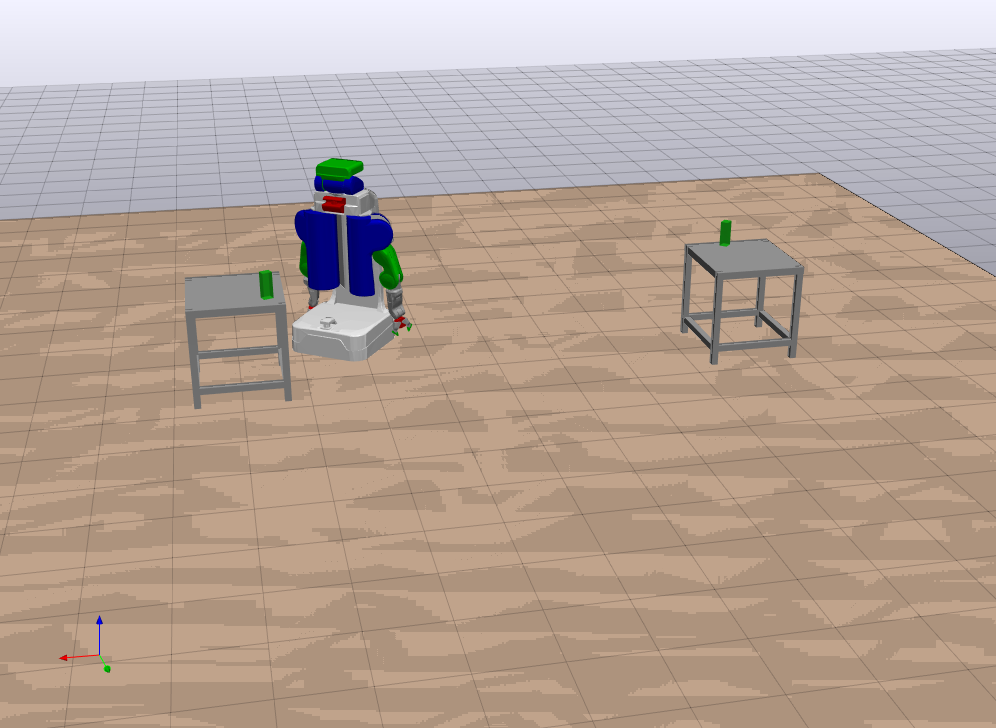

# ss-drake

STRIPStream + drake for python2.7

<!---->


## Installation

### Drake

Download the most recent drake precompiled binaries (http://drake.mit.edu/from_binary.html).

#### OS X

```
wget https://drake-packages.csail.mit.edu/drake/nightly/drake-latest-mac.tar.gz
tar -xvf drake-latest-mac.tar.gz
export PYTHONPATH=${PWD}/drake/lib/python2.7/site-packages:${PYTHONPATH}
```

#### Ubuntu 

```
wget https://drake-packages.csail.mit.edu/drake/nightly/drake-latest-xenial.tar.gz
tar -xvf drake-latest-xenial.tar.gz
export PYTHONPATH=${PWD}/drake/lib/python2.7/site-packages:${PYTHONPATH}
```

### STRIPStream

Clone the following repositories and add them to your PYTHONPATH:

1) https://github.com/caelan/motion-planners
2) https://github.com/caelan/pddlstream

## Examples

1) Test pydrake - ```python -c 'import pydrake'```
2) Test motion-planners - ```python -c 'import motion_planners'```
3) Test STRIPStream - ```python -c 'import ss'```

## Examples

1) Random table placements - ```python test_placements.py```
2) PR2 base motion planning - ```python test_motion.py```
3) Kuka pick & place - ```python test_pick.py```
4) PR2 pick & place - ```python test_kuka_iiwa.py```

## Drake Resources

Homepage - http://drake.mit.edu/index.html

Github - https://github.com/RobotLocomotion/drake
